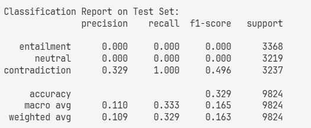
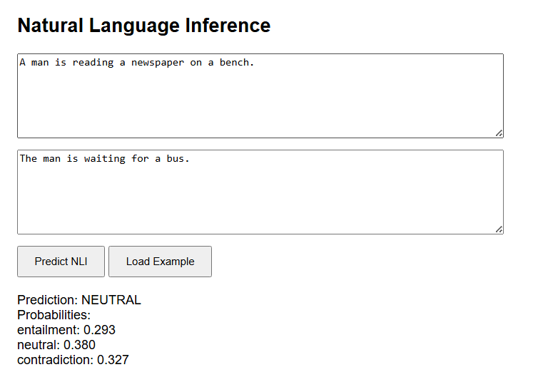

# Text Similarity with BERT and Sentence-BERT

## Overview
This project implements a complete Natural Language Inference (NLI) system using BERT trained from scratch and Sentence-BERT for semantic similarity analysis. The system includes training pipelines, evaluation, and a web application for interactive inference.
## Project Structure
```
NLP_Assignment/
app/
  models/          # Model definitions (BERT, SentenceBERT)
  saved_models/    # Trained models
  templates/       # Web UI templates
  web_app.py       # Flask/Django app entry point
bert train loss.png
Bert.ipynb
SBertLoss.png
Sentence_BERT.ipynb
requirements.txt
ui.png
```

## Installation
```
-> Install dependencies
pip install -r requirements.txt
-> Install spaCy model
python -m spacy download en_core_web_sm
```

## Evaluation Results
### BERT Training Loss


### Sentence BERT Training Loss


### Sentence BERT Classification Report on Test Set


## Run Web Application

Follow these steps to launch the application locally:

1. **Download saved models**  
   - Get the pre-trained models from [Google Drive](https://drive.google.com/drive/folders/1s8OfWZyGfgRVGt0mGwEXV6JBd-sRhu8m?usp=sharing).  
   - Place them inside the `app/saved_models` directory.

2. **Navigate to the project root**  
   - Open a terminal (Command Prompt on Windows or Terminal on macOS/Linux).  
   - Move into the root folder where `web_app.py` is located.  
   ```bash
   cd ...project_root/app
   ```

3. **Activate your Python environment**  
   - Ensure you have a virtual environment set up.  
   ```bash
   # On Windows
   .venv\Scripts\activate

   # On macOS/Linux
   source .venv/bin/activate
   ```

4. **Run the application**  
   ```bash
   python web_app.py
   ```

5. **Open the Flask app in your browser**  
   - Visit: [http://127.0.0.1:5000/](http://127.0.0.1:5000/)  

## Limitations and Challenges
### Technical Limitations
1. **Dataset Size**: Limited to 50k training samples vs. original BERT's 3.3B words
2. **Computational Constraints**: Limited GPU memory for full-scale training
3. **Training Time**: Complete training requires ~24 hours on Tesla T4

### Performance Issues
1. **Zero Entailment and Contradiction Recall and Precision**: Model struggles to identify entailment and contradiction relationships
2. **Class Imbalance**: Neutral class dominates predictions
3. **Overfitting**: Limited training data leads to poor generalization

### Proposed Improvements
1. **Train using large dataset**: Use more data to train bert and sentence bert model
2. **Hyperparameter Optimization**: Systematic search for optimal parameters

## Dataset Sources
1. **BERT Training**: Wikipedia 20220301.en (100k samples)
2. **Sentence-BERT Training**: SNLI dataset from Hugging Face
3. **Evaluation**: SNLI test set

## Web UI Demo


## Acknowledgments
- **BERT Implementation**: Based on classroom materials and original BERT paper
- **Sentence-BERT**: Implementation following "Sentence-BERT: Sentence Embeddings using Siamese BERT-Networks"
- **Datasets**: Wikipedia, SNLI, and MNLI from Hugging Face
- **Frameworks**: PyTorch, Transformers, Flask
