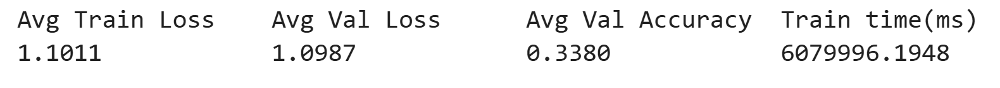

# Text Similarity with BERT and Sentence-BERT

## Overview
This project implements a complete Natural Language Inference (NLI) system using BERT trained from scratch and Sentence-BERT for semantic similarity analysis. The system includes training pipelines, evaluation, and a web application for interactive inference.
## Project Structure
```
NLP_Assignment/
app/
  models/          # Model definitions (BERT, SentenceBERT)
  saved_models/    # Trained models
  templates/       # Web UI templates
  web_app.py       # Flask/Django app entry point
bert train loss.png
Bert.ipynb
SBertLoss.png
Sentence_BERT.ipynb
requirements.txt
ui.png
```

## Installation
```
-> Install dependencies
pip install -r requirements.txt
-> Install spaCy model
python -m spacy download en_core_web_sm
```

## Evaluation Results
### BERT Training Loss


### Sentence BERT Training Loss


### Sentence BERT Classification Report on Test Set

